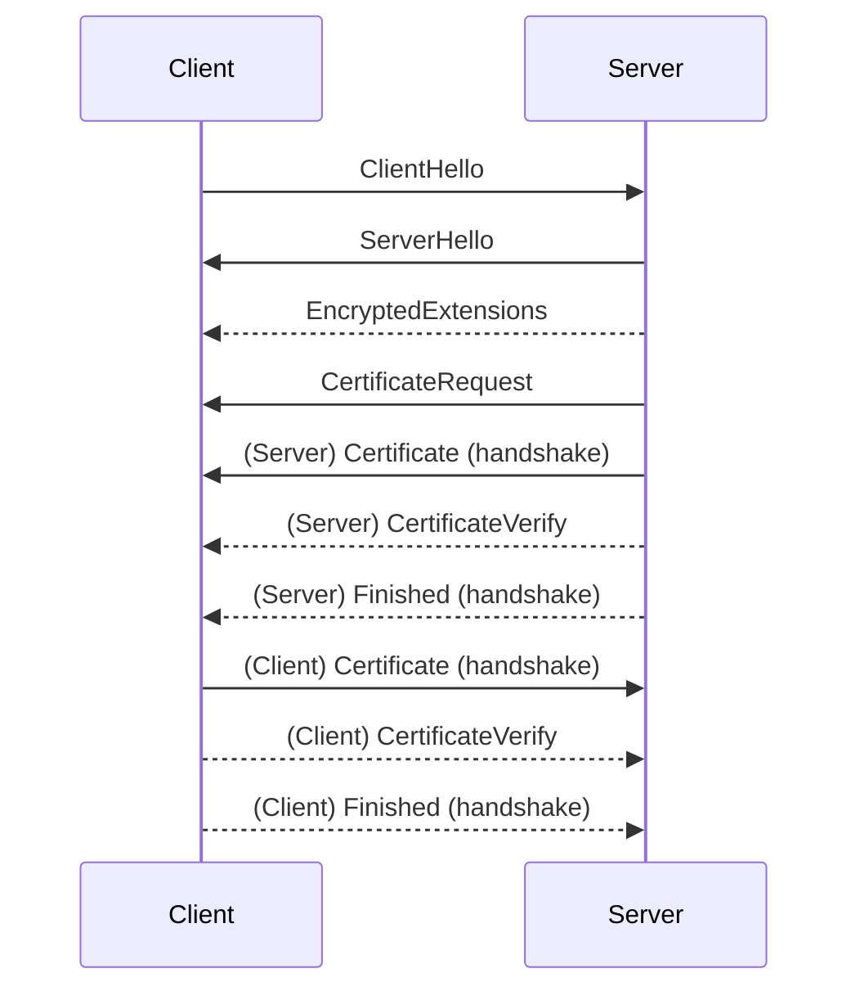

# Validate mTLS client certificate

One way to to do this is to stand up a small Kafka server and test a client certificate against it.

Assuming you have these two files:
* User-provided CA certificate (`custom-ca.crt`), in PEM format (the Confluent Cloud CA provider takes PEM-formatted certificates)
* Client certificate which was signed by custom CA certificate (`client.keystore.p12`), in PKCS12 format (Java Kafka clients take certificates in JKS or PKCS12 format)

This will:
* Create an ephemeral self-signed certificate that will be:
    * Used as the server-side 'keystore' for the Kafka server (presented on the listener)
    * Used as the client-side 'truststore' for the Kafka client (trusted by the client)
* Convert the PEM formatted user-provided CA certificate to PKCS12:
    * Used as the server-side 'truststore' for the Kafka server (trusted on the listener)
* Create a Kafka client authenticating using the PKCS12-formatted client certificate
    * Used as the client-side 'keystore' for the client to authenticate to the Kafka server


### Prerequisites 

On an Ubuntu 22.04 instance (assuming username is `ubuntu`)

```bash
sudo apt-get update && \
sudo apt-get install openjdk-17-jre-headless -y && \
curl -O http://packages.confluent.io/archive/7.7/confluent-7.7.1.tar.gz && \
tar -xzvf confluent-7.7.1.tar.gz && \
ln -s confluent-7.7.1 confluent && \
echo 'export PATH=${PATH}:/home/ubuntu/confluent/bin' >> ~/.bashrc && \
export PATH=${PATH}:/home/ubuntu/confluent/bin

# Create 'internal' key and certificate
# * Server listener keystore
# * Client truststore
openssl req \
        -x509 \
        -newkey rsa:4096 \
        -sha256 \
        -days 365 \
        -nodes \
        -subj "/CN=localhost" \
    -keyout internal.key \
    -out internal.crt

# Create (server) keystore
openssl pkcs12 \
        -export \
        -in internal.crt \
        -inkey internal.key \
        -name internal \
        -password pass:confluent \
    -out server.internal.keystore.p12

# Create (client) truststore
keytool \
        -importcert \
        -alias internal \
        -file internal.crt \
        -storepass confluent \
        -noprompt \
    -keystore client.internal.truststore.p12
```

Assuming user-provided certificate authority is a pem-formatted file "root.crt"
```bash
USER_CA_FILE=custom-ca.crt

keytool \
        -importcert \
        -alias provided \
        -file ${USER_CA_FILE} \
        -storepass confluent \
        -noprompt \
    -keystore server.provided.truststore.p12
```


Create kraft.properties
```bash
tee kraft.properties <<-'EOF'

node.id=9991
# process.roles=controller
process.roles=broker,controller
controller.listener.names=CONTROLLER
controller.quorum.voters=9991@localhost:9093

advertised.listeners=INTERNAL://localhost:9092,BROKER://localhost:9091,MTLS://localhost:9094
#listeners=CONTROLLER://:9093
listeners=CONTROLLER://:9093,INTERNAL://:9092,BROKER://:9091,MTLS://:9094
#listener.security.protocol.map=CONTROLLER:PLAINTEXT,BROKER:PLAINTEXT
listener.security.protocol.map=CONTROLLER:PLAINTEXT,INTERNAL:PLAINTEXT,BROKER:PLAINTEXT,MTLS:SSL
inter.broker.listener.name=BROKER

ssl.keystore.location=server.internal.keystore.p12
ssl.keystore.password=confluent
ssl.key.password=confluent

ssl.truststore.location=server.provided.truststore.p12
ssl.truststore.password=confluent
ssl.client.auth=required

confluent.cluster.link.metadata.topic.replication.factor=1

confluent.balancer.topic.replication.factor=1
confluent.license.topic.replication.factor=1
confluent.metadata.topic.replication.factor=1
confluent.security.event.logger.exporter.kafka.topic.replicas=1

log.dirs=/tmp/kafka/data
num.partitions=1
offsets.topic.replication.factor=1
transaction.state.log.min.isr=1
transaction.state.log.replication.factor=1
EOF
```

```bash
sudo mkdir -p /tmp/kafka/data
sudo chown $(id -u):$(id -g) /tmp/kafka/data
kafka-storage format -t $(kafka-storage random-uuid) -c kraft.properties
```

# Start the Kafka server
(note debug for SSL handshake)
```bash
KAFKA_OPTS="-Djavax.net.debug=ssl:handshake" kafka-server-start kraft.properties
```

# Client side
(In a different shell session on the same server, create a client configuration file)

Assume user-provided client certificate is already pkcs12-formatted file `client.keystore.p12` and has password `changeme`

```bash
tee client.properties <<-'EOF'
bootstrap.servers=localhost:9094
security.protocol=SSL
ssl.truststore.location=client.internal.truststore.p12
ssl.truststore.password=confluent

ssl.keystore.location=client.keystore.p12
ssl.keystore.password=changeme
EOF
```

Try to connect, look at logs on both server and client side
```bash
KAFKA_OPTS="-Djavax.net.debug=ssl:handshake" kafka-broker-api-versions --bootstrap-server localhost:9094 --command-config client.properties
```

### Approximate data flow:


